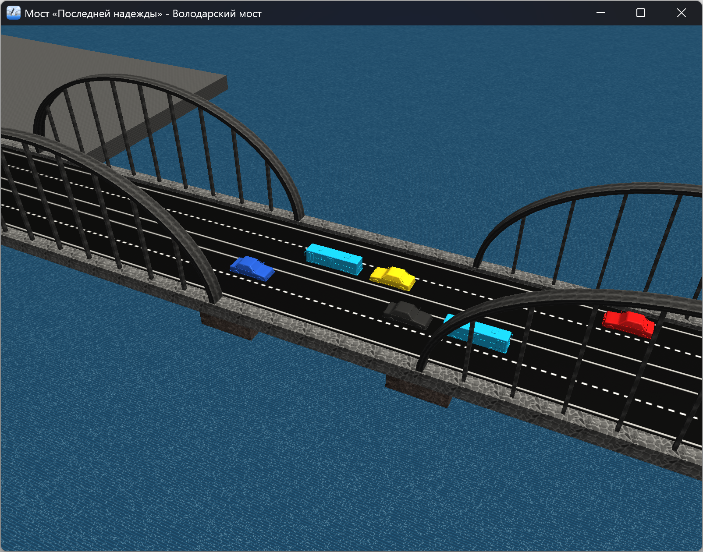
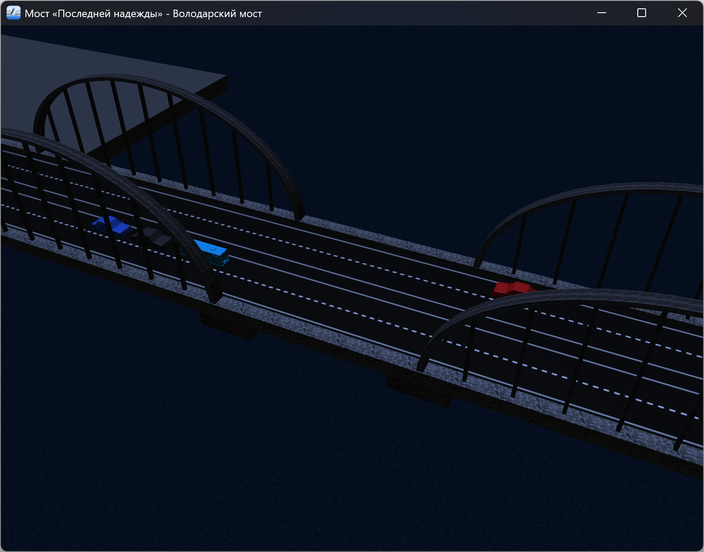

# Володарский мост

Данный репозиторий содержит реализацию интерактивной 3D-сцены **«Володарский мост»** с использованием библиотеки
**OpenGL** и фреймворка **Qt**.

Проект выполнен в рамках курсовой работы по дисциплине _«Компьютерная геометрия и графика»_ 5 семестра направления
подготовки _09.03.04 «Программная инженерия»_ **БГТУ «ВОЕНМЕХ» им. Д.Ф. Устинова**.

Сцена представляет собой стилизованную модель разводного моста с динамическим освещением, анимацией, транспортом, водной
поверхностью и звуковым сопровождением.

---

## Цель работы

Целью курсовой работы является разработка интерактивной 3D-сцены,
демонстрирующей применение современных методов компьютерной графики:

- работа с графическим конвейером OpenGL;
- использование вершинных и фрагментных шейдеров;
- реализация 3D-камеры с управлением;
- анимация объектов сцены;
- моделирование смены времени суток;
- загрузка и визуализация 3D-моделей;
- наложение текстур на объекты и модели;
- синхронизация графики и звука.

---

## Возможности сцены

- интерактивное управление камерой;
- анимация развода моста;
- движение автомобилей и автобусов;
- прохождение судна под мостом;
- смена дня и ночи с плавным переходом освещения;
- анимированная водная поверхность;
- звуковое сопровождение;
- обработка кликов по объектам сцены.

---

## Стек технологий

- **C++17** — язык реализации проекта;
- **Qt 6.8.3** — оконный интерфейс, OpenGL-контекст, ввод и мультимедиа;
- **OpenGL 3.3** — рендеринг 3D-графики;
- **GLSL** — вершинные и фрагментные шейдеры;
- **OBJ + MTL** — формат хранения 3D-моделей и материалов;
- **Inno Setup 6.6.1** — создание установщика под Windows 11.

---

## Управление сценой

Управление камерой и анимацией осуществляется клавиатурой.

| Управление | Действие                       |
|------------|--------------------------------|
| `←` / `→`  | Орбитальное вращение камеры    |
| `↑` / `↓`  | Приближение / удаление камеры  |
| `W` / `S`  | Изменение угла наклона камеры  |
| `A` / `D`  | Сдвиг камеры влево / вправо    |
| `Space`    | Смена дня и ночи, развод моста |
| `Ctrl + ?` | Диалоговое окно «О программе»  |

---

## Анимация развода моста

При нажатии клавиши `Space` запускается сценарий ночного времени суток:

1. Движение транспорта постепенно останавливается.
2. Освещение сцены плавно переходит в ночной режим.
3. Центральный пролёт моста разводится.
4. Судно проходит под мостом.
5. Мост закрывается, движение транспорта возобновляется.
6. Происходит плавный переход обратно к дневному освещению.

Все этапы сопровождаются звуковыми эффектами.

---

## Сборка и запуск

### Сборка из исходников

Проект собран с помощью **Qt Creator 18.0.0 (Community)** и утилиты автоматизации сборки **qmake**.

### Установщик

Для удобства распространения проекта подготовлен установщик под _Windows 11_ с помощью **Inno Setup Compiler 6.6.1**.

После установки приложение можно запускать из меню _«Пуск»_ или с рабочего стола.

---

## Скриншоты

### Дневная сцена

### Ночная сцена

### Развод моста

---

## Об авторе

**Илья Аносов** — студент 3 курса направления подготовки «Программная инженерия» БГТУ «ВОЕНМЕХ» им. Д.Ф. Устинова.

---

## Лицензия

Проект распространяется под лицензией **MIT**.  
_Подробнее:_ см. файл [LICENSE](LICENSE).
